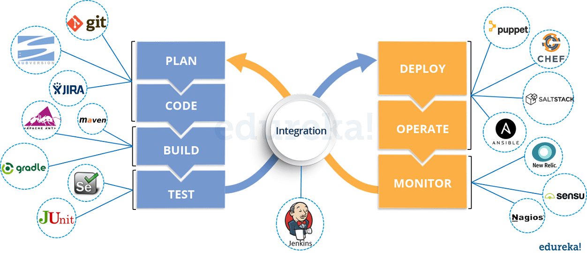

# DevOps Interview Questions




Explain DevOps.
```
• DevOps promotes communication and collaboration between business, development & operations teams.
• DevOps is not only about tools but also about involving people and process.
• DevOps is inspired by the Agile process.
• DevOps is about automating the development, release and operation processes.
• DevOps helps in the speed of delivering applications to the end users.
• DevOps is also about continuous improvement which helps in learning through feedback.
```

Explain a few prerequisites that are useful for DevOps implementation.
```
• Commitment at the senior level in the organization.
• Need for change to be communicated across the organization.
• Version control software.
• Automated tools for compliance to process.
• Automated Testing
• Automated Deployment
```

What are the key components of DevOps?
```
• Continuous Integration
• Continuous Testing
• Continuous Delivery
• Continuous Monitoring
```

Which are the top DevOps tools?
```
• Git/SVN/Bitbucket : Version Control System tool
• Jenkins : Continuous Integration tool
• Selenium : Continuous Testing tool
• Puppet, Chef, Ansible : Configuration Management and Deployment tools
• Nagios/Splunk : Continuous Monitoring tool
• Docker : Containerization tool
• Jira
• Bamboo
• SonarQube
• Artifactory/Nexus
• IBM Urbancode Deploy / CA-RA
```

Top Continuous Integration Tools
```
• Jenkins
• TeamCity
• Travis CI
• Go CD
• Bamboo
• GitLab CI
• CircleCI
• Codeship
```

explain the uses of the tools just mentioned and how they connect to give a DevOps model (CI/CD)?
```
##### Planning
**Jira** – Used for Project Planning and Issue management

##### Continuous Integration
**Git** – Version Control
**Jenkins** – Open Source Continuous Integration tool which can also help in Continuous Delivery.
**SonarQube** – Code analysis
**JFrog Artifactory** – Binary Repository Manager

##### Continuous Delivery
**Chef / Puppet / Ansible** – Configuration Management and Application Deployment
**IBM Urbancode Deploy / CA RA** – Continuous Delivery

##### Continuous Monitoring
**Nagios / Splunk**
```

How do all these tools work together?
```
1. Developers develop the code and this source code is managed by Version Control System tools like Git etc.
2. Developers send this code to the Git repository and any changes made in the code is committed to this Repository.
3. Jenkins pulls this code from the repository using the Git plugin and build it using tools like Ant or Maven.
4. Configuration management tools like puppet deploys & provisions testing environment and then Jenkins releases 
   this code on the test environment on which testing is done using tools like selenium.
5. Once the code is tested, Jenkins send it for deployment on the production server 
   (even production server is provisioned & maintained by tools like puppet).
6. After deployment It is continuously monitored by tools like Nagios.
7. Docker containers provides testing environment to test the build features.
```

What are the advantages of DevOps?
```
Technical benefits:
• Continuous software delivery
• Less complex problems to fix
• Faster resolution of problems

Business benefits:
• Faster delivery of features
• More stable operating environments
• More time available to add value (rather than fix/maintain)
```

In Git how do you revert a commit that has already been pushed and made public?
```
• Remove or fix the bad file in a new commit and push it to the remote repository. This is the most 
natural way to fix an error. Once you have made necessary changes to the file, commit it to the remote 
repository for that I will use git commit -m “commit message”

• Create a new commit that undoes all changes that were made in the bad commit.to do this I will 
use a command git revert <name of bad commit>
```

What is Continuous Integration (CI)?
```
	Continuous integration (CI) is a software engineering practice in which isolated changes are immediately 
tested and reported on when they are added to a larger code base. Continuous Integration (CI) is a development 
practice where developers integrate code into a shared repository frequently, preferably several times a day. 
Each integration can then be verified by an automated build and automated tests.
```

What is a Continuous delivery pipeline?
```
	A continuous delivery pipeline is an automated expression of your process for getting software from 
version control right through to your users and customers.
```
