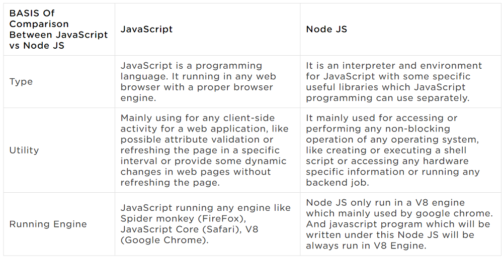

# Javascript Interview Questions




javascript is synchronous or asynchronous
```
JavaScript is always synchronous and single-threaded. 
If you're executing a JavaScript block of code on a page then no other JavaScript on that page will currently be executed.
JavaScript is only asynchronous in the sense that it can make, for example, Ajax calls. 
The Ajax call will stop executing and other code will be able to execute until the call returns (successfully or otherwise), 
at which point the callback will run synchronously. 
No other code will be running at this point. It won't interrupt any other code that's currently running.
```

List some data types supported by Javascript?
```
Undefined
Null
Boolean
String
Symbol
Number
Object
```

What is the difference between null and undefined in JavaScript?
```
undefined means a variable has been declared but has not yet been assigned a value
null is an assignment value. It can be assigned to a variable as a representation of no value
```

Closure in javascript
```
a closure gives you access to an outer function's scope from an inner function. 
In JavaScript, closures are created every time a function is created, at function creation time. 
To use a closure, simply define a function inside another function and expose it.
```

this Keyword in javascript
```
The JavaScript this keyword refers to the object it belongs to.
In a method, this refers to the owner object.
Alone, this refers to the global object.
In a function, this refers to the global object.
In a function, in strict mode, this is undefined.
In an event, this refers to the element that received the event.
Methods like call(), and apply() can refer this to any object.
```

Use Strict in javascript
```
"use strict" :- Defines that JavaScript code should be executed in "strict mode".
The "use strict" directive was new in ECMAScript version 5.
Declared inside a function, it has local scope (only the code inside the function is in strict mode):
Strict mode makes it easier to write "secure" JavaScript.
In strict mode, any assignment to a non-writable property, a getter-only property, a non-existing property, 
a non-existing variable, or a non-existing object, will throw an error.
*	Using a variable, without declaring it, is not allowed:
*	Using an object, without declaring it, is not allowed:
*	Deleting a variable (or object) is not allowed.
*	Deleting a function is not allowed.
*	Duplicating a parameter name is not allowed:
*	Writing to a read-only property is not allowed:
*	Writing to a get-only property is not allowed:
*	Deleting an undeletable property is not allowed:
```


Hoisting in javascript
```
Hoisting is JavaScript's default behavior of moving all declarations to the top of the current scope 
(to the top of the current script or the current function).
Variables and constants declared with let or const are not hoisted!
JavaScript Initializations are Not Hoisted
```

3 types of functions in JavaScript:
```
*	Named function
*	Anonymous function
*	Immediately invoked function expression. It runs as soon as the browser finds it.
```

Self-Invoking Functions
```
Function expressions can be made "self-invoking".
A self-invoking expression is invoked (started) automatically, without being called.
Function expressions will execute automatically if the expression is followed by ().
You cannot self-invoke a function declaration.
You have to add parentheses around the function to indicate that it is a function expression:
The self-invoking function only runs once.
```

anonymous function in javascript
```
Anonymous functions are functions that are dynamically declared at runtime. They're called 
anonymous functions because they aren't given a name in the same way as normal functions.
```

recursive function in javascript
```
A recursive function is a function that calls itself.
```

arrow function in javascript
```
Arrow functions were introduced with ES6 as a new syntax for writing JavaScript functions. 
They save developers time and simplify function scope.
```

JavaScript Object Prototypes
```
All JavaScript objects inherit properties and methods from a prototype.
```

Prototypes in javascript
```
When a function is created in JavaScript, JavaScript engine adds a prototype property to the function. 
This prototype property is an object (called as prototype object) has a constructor property by default. 
constructor property points back to the function on which prototype object is a property. 
We can access the function’s prototype property using the syntax functionName.prototype.
*  The JavaScript prototype property allows you to add new properties to object constructors:
*  The JavaScript prototype property also allows you to add new methods to objects constructors:


```

Prototype Inheritance
```
Date objects inherit from Date.prototype
Array objects inherit from Array.prototype
Person objects inherit from Person.prototype
The Object.prototype is on the top of the prototype inheritance chain:
```

JavaScript — Multiple ways to create object
```
Create JavaScript Object with Object Literal
Create JavaScript Object with Constructor
Create JavaScript Object with create method
Create JavaScript Object using ES6 classes
```

difference between local storage and session storage
```
local storage is a method by which Web pages locally store named key/value pairs inside a client's Web browser.
sessionStorage object is equal to the localStorage object, except that it stores the data for only one session.
sessionStorage object stores data only for a session, meaning that the data is stored until the browser (or tab) is closed.
Cookie stores data that has to be sent back to the server with subsequent requests.
window.localStorage - stores data with no expiration date
window.sessionStorage - stores data for one session
```

What is Inheritance
```
Inheritance in most class-based object-oriented languages is a mechanism in which one object acquires 
all the properties and behaviors of another object. JavaScript is not a class-based language although 
class keyword is introduced in ES2015, it is just syntactical layer. JavaScript still works on prototype chain.
```

Do classes exist in JavaScript?
```
It's important to note that there are no classes in JavaScript. Functions can be used to somewhat simulate classes, 
but in general JavaScript is a class-less language. Everything is an object. And when it comes to inheritance,
objects inherit from objects, not classes from classes as in the "class"-ical languages.
```

What are the different types of objects in JavaScript?
```
JavaScript has one complex data type, the Object data type, and it has five simple data types: Number, String, 
Boolean, Undefined, and Null. Note that these simple (primitive) data types are immutable (cannot be changed), 
while objects are mutable (can be changed).Jan 27, 2013
```