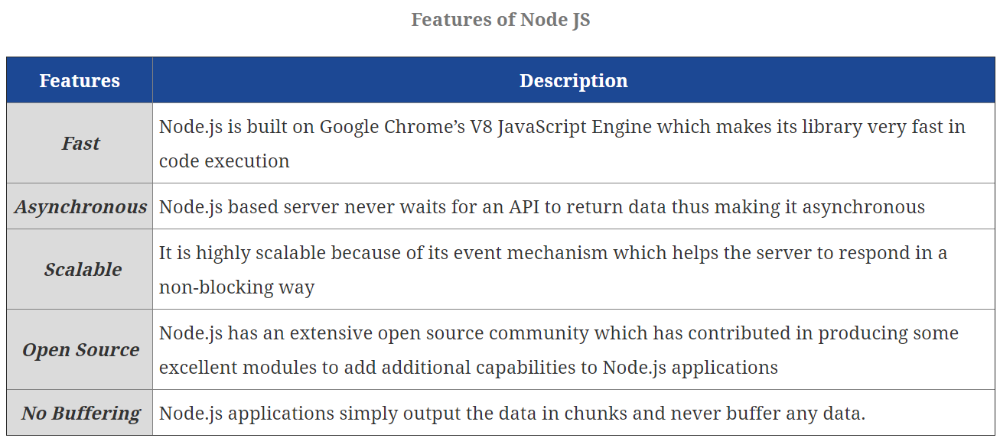
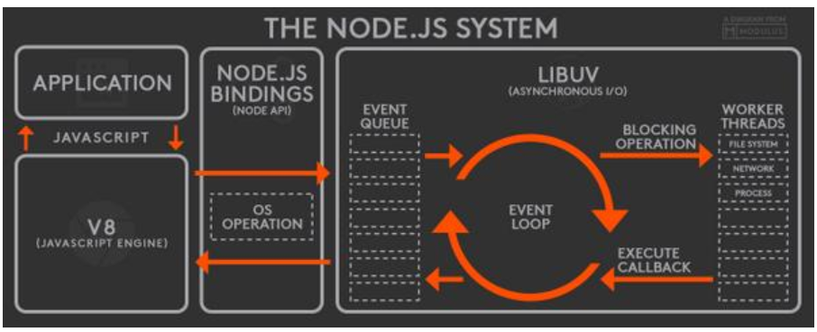

# NodeJS Interview Questions



What is Node.js?
```
Node.js as “an open-source, cross-platform runtime environment for developing server-side Web applications.”
It is essentially server side scripting which is used to build scalable programs.
```

In which Language Node Js is written ?
```
Node js is written in C, C++,JavaScript.It uses Google’s open source V8 Javascript Engine to convert Javascript code to C++.
```

Explain ECMAScript ?
```
ECMAScript is the standard on which Javascript is based on. 
JavaScript is a subset of ECMAScript.
JavaScript is basically ECMAScript at its core but builds upon it.
```

What Are The Key Features Of Node.Js?
```
*	Asynchronous event driven IO helps concurrent request handling
*	Fast in Code execution 
*	Single Threaded but Highly Scalable
*	Node.js library uses JavaScript
*	No Buffering 
```

When Should We Use Node.Js?
```
*	it’s good to use Node.js, when you need high levels of concurrency but less amount of dedicated CPU time.
*	it's good for fast and high-performance servers, that face the need to handle thousands of user requests simultaneously.
*	Chat applications.
*	Game servers.
*	I/O bound Applications
*	Single Page Applications
*	JSON APIs based Applications
*	Data Streaming Applications
*	Data Intensive Real-time Applications(DIRT)
*	Web applications(especially real-time web apps)
*	Network applications
*	Distributed systems
*	General purpose applications
```

When To Not Use Node.Js?
```
*	we should not use it for cases where the application requires long processing time. 
*	If the server is doing some calculation, it won’t be able to process any other requests. 
*	Hence, Node.js is best when processing needs less dedicated CPU time.
```

What is the advantage of using node.js?
```
*	It provides an easy way to build scalable network programs
*	Generally fast
*	Great concurrency
*	Asynchronous everything
*	Almost never blocks
```

What Is NPM In Node.Js?
```
NPM stands for Node Package Manager. It provides following two main functionalities.
It works as an Online repository for node.js packages/modules which are present at <nodejs.org>.
It works as Command line utility to install packages, do version management and dependency management of Node.js packages.
```

What are events ?
```
An event is an action recognized by software/app that is handled by event handler by writing a code 
that will be executed when the event fired.
Mouse move, Click, file copied or deleted are some examples of events.
In Node Js there are two types of events.
1)System Events: The event that comes from the C++ side.
2)Custom Events: Custom events are user-defined events.
```

What does event-driven programming mean?
```
*	In computer programming, event driven programming is a programming paradigm in which the flow of the 
	program is determined by events like messages from other programs or threads. 
*	It is an application architecture technique divided into two sections  1)Event Selection  2)Event Handling
```

What is clustering in Node.js
```
Node.js runs single threaded programming, which is very memory efficient, but to take advantage of computers 
multi-core systems, the Cluster module allows you to easily create child processes that each runs on their 
own single thread, to handle the load.
```

Name some of the events fired by streams.
```
*	Each type of Stream is an EventEmitter instance and throws several events at different instance of times.
	For example, some of the commonly used events are:
	data    −  This event is fired when there is data is available to read.
	end     −  This event is fired when there is no more data to read.
	error   −  This event is fired when there is any error receiving or writing data.
	finish  −  This event is fired when all data has been flushed to underlying system
```

What are streams?
```
*	Streams are objects that let you read data from a source or write data to a destination in continuous fashion.
	Readable  − Stream which is used for read operation.
	Writable  − Stream which is used for write operation.
	Duplex    − Stream which can be used for both read and write operation.
	Transform − A type of duplex stream where the output is computed based on input.
```


What is purpose of Buffer class in Node?
```
*	Buffer class is a global class and can be accessed in application without importing buffer module. 
	A Buffer is a kind of an array of integers and corresponds to a raw memory allocation outside the V8 heap. 
	A Buffer cannot be resized.
```

setTimeout(fn, delay)
```
*	setTimeout(fn, delay) calls the given callback fn after the given delay has ellapsed (in milliseconds). 
	However, the callback is not executed immediately at this time, but added to the function queue so that 
	it is executed as soon as possible, after all the currently executing and currently queued event handlers 
	have completed. Setting the delay to 0 adds the callback to the queue immediately so that it is executed 
	as soon as all currently-queued functions are finished.
```

setImmediate(fn)
```
*	achieves the same effect from setTimeout, except that it doesn’t use the queue of functions. 
	Instead, it checks the queue of I/O event handlers. If all I/O events in the current snapshot are processed, 
	it executes the callback. It queues them immediately after the last I/O handler somewhat like process.nextTick.
	This is faster than setTimeout(fn, 0).
```

Process.nextTick
```
*	In Node.js, each iteration of an Event Loop is called a tick.
*	To schedule a callback function to be invoked in the next iteration of the Event Loop, we use process.nextTick(). 
*	It just takes a callback with no time bound, since it will be executing in the next iteration of the Event Loop.
*	it schedules a function to be executed when the current tick ends.
```

How does Node.js handle child threads?
```
*	Node.js, in its essence, is a single thread process. It does not expose child threads and thread management methods 
	to the developer. Technically, Node.js does spawn child threads for certain tasks such as asynchronous I/O, 
	but these run behind the scenes and do not execute any application JavaScript code, nor block the main event loop.
```

What is the preferred method of resolving unhandled exceptions in Node.js?
```
*	Unhandled exceptions in Node.js can be caught at the Process level by attaching a handler for uncaughtException event.
	process.on('uncaughtException', function(err) {
	  console.log('Caught exception: ' + err);
	});
```

How does Node.js support multi-processor platforms, and does it fully utilize all processor resources?
```
*	Since Node.js is by default a single thread application, it will run on a single processor core and will 
	not take full advantage of multiple core resources. However, Node.js provides support for deployment on 
	multiple-core systems, to take greater advantage of the hardware. The Cluster module is one of the core 
	Node.js modules and it allows running multiple Node.js worker processes that will share the same port.
```

What is REPL? What purpose it is used for?
```
*	REPL stands for (READ, EVAL, PRINT, LOOP). Node js comes with bundled REPL environment. 
	This allows for the easy creation of CLI (Command Line Interface) applications.
```

What do you mean by Asynchronous API?
```
*	All APIs of Node.js library are aynchronous that is non-blocking. It essentially means a Node.js based server 
	never waits for a API to return data. Server moves to next API after calling it and a notification mechanism of Events 
	of Node.js helps server to get response from the previous API call.
```

What is the use of Underscore variable in REPL?
```
*	Use _ to get the last result.
```

What is Event Loop?
```
*	Node js is a single threaded application but it support concurrency via concept of event and callbacks. 
	As every API of Node js are asynchronous and being a single thread, it uses async function calls to maintain the concurrency. 
	Node uses observer pattern. Node thread keeps an event loop and whenever any task get completed, it fires the corresponding 
	event which signals the event listener function to get executed.
```

What is Piping in Node?
```
Piping is a mechanism to connect output of one stream to another stream. It is normally used to get data 
from one stream and to pass output of that stream to another stream. There is no limit on piping operations.
```

What is difference between synchronous and asynchronous method of fs module?
```
Every method in fs module have synchronous as well as asynchronous form. Asynchronous methods takes a last parameter as 
completion function callback and first parameter of the callback function is error. It is preferred to use asynchronous 
method instead of synchronous method as former never block the program execution where the latter one does
```

What is Chaining in Node?
```
Chanining is a mechanism to connect output of one stream to another stream and create a chain 
of multiple stream operations. It is normally used with piping operations.
```


What Is A Child_process Module In Node.Js?
```
Node.js supports the creation of child processes to help in parallel processing along with the event-driven model.
The Child processes always have three streams <child.stdin>, child.stdout and child.stderr.
	The <stdio> stream of the parent process shares the streams of the child process.
	exec  – <child_process.exec> method runs a command in a shell/console and buffers the output.
	spawn – <child_process.spawn> launches a new process with a given command.
	fork  – <child_process.fork> is a special case of the spawn() method to create child processes.
```

difference between thread and process
```
Threads are used for small tasks, whereas processes are used for more 'heavyweight' tasks – basically 
the execution of applications. Another difference between a thread and a process is that threads within 
the same process share the same address space, whereas different processes do not.
```

What is Event Emmitter?
```
	// import events module
	var events = require('events');
	// create an eventEmitter object
	var eventEmitter = new events.EventEmitter();
When an EventEmitter instance faces any error, it emits an 'error' event. When new listener is added, 
'newListener' event is fired and when a listener is removed, 'removeListener' event is fired.
EventEmitter provides multiple properties like on and emit. on property is used to bind a function 
with the event and emit is used to fire an event.
```


What Is Callback Hell?
```
Callback hell is heavily nested callbacks which make the code unreadable and difficult to maintain.
```

Use Promises Mechanism.
```
Promises give an alternate way to write async code. They either return the result of execution or the error/exception. 
Implementing promises requires the use of <.then()> function which waits for the promise object to return. 
It takes two optional arguments, both functions. Depending on the state of the promise only one of them will get called. 
The first function call proceeds if the promise gets fulfilled. However, if the promise gets rejected, 
then the second function will get called.
```

Node.js Core Modules
```
• http : http module includes classes, methods and events to create Node.js http server.
• url	: url module includes methods for URL resolution and parsing.
• querystring	: querystring module includes methods to deal with query string.
• path : path module includes methods to deal with file paths.
• fs : fs module includes classes, methods, and events to work with file I/O.
• util : util module includes utility functions useful for programmers.
• net : provides the foundation for creating TCP server and clients
• dgram : provides functionality for creating UDP/Datagram sockets
• http : provides a high-performing foundation for an HTTP stack
• https : provides an API for creating TLS/SSL clients and servers
```

What are node.js bindings?
```
Bindings basically are libraries that "bind" two different programming languages so that 
code written in one language can be used in code written in another library. 
With the presence of bindings, you don't have to write all the code again just because they 
are in different languages. Another motivation for bindings is that you can benefit from 
the advantages of different programming languages. For example, C/C++ are much faster 
than JavaScript. It might be beneficial to write some code in C/C++ for performance purposes.
```

Buffers in NodeJs ?
```
While dealing with TCP streams or the file system, it's necessary to handle octet streams. 
Node provides Buffer class which provides instances to store raw data similar to an 
array of integers but corresponds to a raw memory allocation outside the V8 heap. 
Buffer class is a global class that can be accessed in an application without importing the buffer module.
var buf = new Buffer(10);
var buf = new Buffer([10, 20, 30, 40, 50]);
var buf = new Buffer("Simply Easy Learning", "utf-8");
```

Explain libuv
```
libuv(Unicorn Velociraptor Library) is a multi-platform C library that provides support 
for asynchronous I/O based on event loops. It supports epoll(4), kqueue(2), Windows IOCP, 
and Solaris event ports. It is primarily designed for use in Node.js but 
it is also used by other software projects.
```

Why We Use Use strict in JavaScript?
```
Strict Mode is a new feature in ECMAScript 5 that allows you to place a program, or a function, 
in a "strict" operating context. This strict context prevents certain actions from being 
taken and throws more exceptions.
Strict mode helps out in a couple ways:
It catches some common coding bloopers, throwing exceptions.
It prevents, or throws errors, when relatively "unsafe" actions are taken.
It disables features that are confusing or poorly thought out.
```

Difference Between Var, Let and Const in ES6
```
• var:
With “var” there are only two types of scope for a variable.There is global scope which 
is where we would place a variable if we define the variable with “var” outside of any function.
And then there is function scope for variable defined inside of a function. But there is no block scope.
• let:
using “let” keyword we can declare truly block-scoped variables.
Redeclaring the same variable within the same function or block scope raises a TypeError.
• const:
We will use “const” keyword to create and initialize a read-only variable that will hold a 
constant value and something that we can never change. 
The value of a constant cannot change through re-assignment, and it can’t be redeclared.
```

Single Threaded Event Loop Model Processing 
```
• Clients Send request to Web Server.
• Node JS Web Server internally maintains a Limited Thread pool to provide services to the Client Requests.
• Node JS Web Server receives those requests and places them into a Queue. It is known as “Event Queue”.
• Node JS Web Server internally has a Component, known as “Event Loop”. Why it got this name is that 
  it uses indefinite loop to receive requests and process them. (See some Java Pseudo code to understand this below).
• Event Loop uses Single Thread only. It is main heart of Node JS Platform Processing Model.
• Even Loop checks any Client Request is placed in Event Queue. If no, then wait for incoming requests for indefinitely.
• If yes, then pick up one Client Request from Event Queue
	• Starts process that Client Request
	• If that Client Request Does Not requires any Blocking IO Operations, then process everything, prepare response and send   it back to client.
	• If that Client Request requires some Blocking IO Operations like interacting with Database, File System, External Services then it will follow different approach
		• Checks Threads availability from Internal Thread Pool
		• Picks up one Thread and assign this Client Request to that thread.
		• That Thread is responsible for taking that request, process it, perform Blocking IO operations, prepare response and  send it back to the Event Loop
		• Event Loop in turn, sends that Response to the respective Client.
```	



How does node js handle child threads?
```
Node.js, in its essence, is a single thread process. Technically, Node.js does spawn child threads 
for certain tasks such as asynchronous I/O, but these run behind the scenes and do not execute any 
application JavaScript code, nor block the main event loop.
```

What is thread pool in node JS?
```
The libuv library maintains a pool of threads that is used by node.js to perform long-running operations 
in the background, without blocking its main thread. Effectively, deep under the hood, node.js is thread-based,
whether you like it or not. The thread pool is used through submitting a work request to a queue.
```

Why Nodejs is single threaded?
```
All Node JS applications uses “Single Threaded Event Loop Model” architecture to handle multiple concurrent clients. 
The main event loop is single-threaded but most of the I/O works run on separate threads, because the I/O 
APIs in Node.js are asynchronous/non-blocking by design, in order to accommodate the event loop.
```

“package-lock.json” role
```
It stores an exact, versioned dependency tree rather than using starred versioning like package.json 
itself (e.g. 1.0.*). This means you can guarantee the dependencies for other developers or prod releases, etc. 
It also has a mechanism to lock the tree but generally will regenerate if package.json changes.
```

How can you avoid callbacks?
```
*  You can use modularization. It breaks callbacks into independent functions.
*  You can use promises.
*  You can use yield with Generators and Promises.
```

What tools can be used to assure a consistent style in Node.js?
```
*  JSLint
*  JSHint
*  ESLint
*  JSCS
```

What is the role of assert in Node.js?
```
The Node.js Assert is a way to write tests. It provides no feedback when running your test unless one fails. 
The assert module provides a simple set of assertion tests that can be used to test invariants. 
The module is intended for internal use by Node.js, but can be used in application code via require ('assert').
```

Node.js Global Objects
```
__dirname
__filename
Console
Process
Buffer
setImmediate(callback[, arg][, ...])
setInterval(callback, delay[, arg][, ...])
setTimeout(callback, delay[, arg][, ...])
clearImmediate(immediateObject)
clearInterval(intervalObject)
clearTimeout(timeoutObject)
```

Node.js ZLIB
```
The Node.js Zlib module is used to provide compression and decompression (zip and unzip) functionalities. 
It is implemented using Gzip and deflate/inflate.
Compressing and decompressing a file can be done by piping the source stream data into a destination stream through zlib stream.
Node.js ZLIB module to compress a file "input.txt" into "input.txt.gz" using const zlib = require('zlib').
```

WHAT IS Middlware ?
```
*	Middleware is a subset of chained functions called by the Express js routing layer before the user-defined handler is invoked.
	Middleware functions have full access to the request and response objects and can modify either of them.
*	A middleware is basically a function that will the receive the Request and Response objects, 
	just like your route Handlers do. As a third argument you have another function which you should call once your 
	middleware code completed. This means you can wait for asynchronous database or network operations to finish before 
	proceeding to the next step. This might look like the following:
*	IT CAN BE USED AS :  Authentication, Logging
Application-level middleware
Router-level middleware
Error-handling middleware
Built-in middleware
Third-party middleware
Example : 
	app.use(userMiddleware)
	app.get('/someroute', handler)
```
