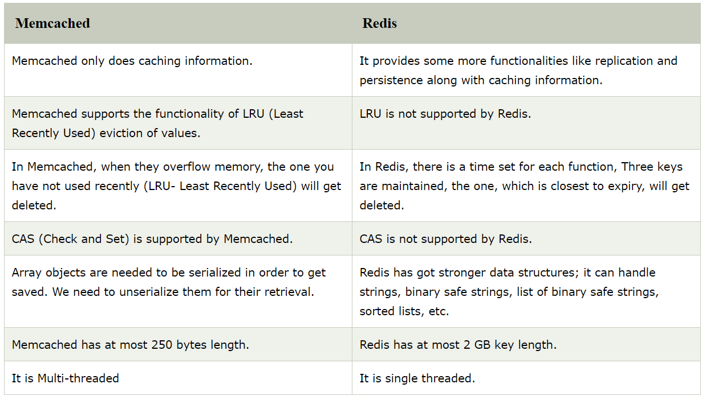

# Redis Interview Questions




What is Redis?
```
*  Redis stands for REmote DIctionary Server.
*  Redis is an open source, BSD licensed.
*  in memory data structure store, used as database.
*  Redis stands for REmote DIctionary Server.
*  advanced key-value store.
*  read, write data as key-value.
*  there is no structure like table,row,column
*  keep data in cach
*  Redis is very fast. It can execute 100000 queries per second.
*  Redis is written in ANSI C and mostly used for cache solution and session management
*  performence major feature
*  flexible
*  no statement like select insert update,
*  it has option to write data in disk and this option is configrable
*  master-slave replication feature
*  it is single threaded
*  Redis had a maximum of 2GB key length
*  It supports a server-side locking
*  Redis is portable.
*  It supports Atomic Operation.
*  It has got lots of client lib
*  Redis natively supports Publish/ Subscribe
*  It supports data structures such as strings, hashes, lists, sets, sorted sets with range queries, bitmaps, 
   hyperloglogs and geospatial indexes with radius queries.
*  any short lived data in your application like web application sessions, web page hit counts, etc.
*  Use redis-cli to access the server.
*  Redis can replicate data to any number of slaves.
*  Redis benchmark is the utility to check the performance of Redis by running n commands simultaneously.
*  Redis supports sharding. It is very easy to distribute the dataset across multiple Redis instances, like other key-value store.
*  redis-server is the Redis Server itself.
*  redis-sentinel is the Redis Sentinel executable (monitoring and failover).
*  redis-cli is the command line interface utility to talk with Redis.
*  redis-benchmark is used to check Redis performances.
*  redis-check-aof and redis-check-dump are useful in the rare event of corrupted data files.
```

Redis command
```
*	sudo service redis_6379 start
*	sudo service redis_6379 stop
*	sudo service redis_6379 restart
*	redis-cli ping
*	CONFIG get requirepass
*	CONFIG SET requirepass "LaxmanPassword"
*	AUTH password 
*	CONFIG GET *
*	CONFIG SET CONFIG_SETTING_NAME NEW_CONFIG_VALUE
*	config get maxclients
*	CLIENT LIST	
*	SAVE
*	BGSAVE
```

How is Redis different from other databases?
```
	Redis is a NoSQL, Opensource, in-memory data-structure store. It follows the principle of key-value store.
It is extremely fast, persistent, portable and supports many languages.
```

In which language Redis is written?
```
Redis is written in ANSI C and mostly used for cache solution and session management. 
It creates unique keys for store values.
```

What is the usage of Redis?
```
Redis is a special key-value store database that can function as a NoSQL database or as a memory-cache store to 
improve performance when serving data that is stored in system memory.
```

What are the main features of Redis?
```
*  Redis is very simple to install setup and manage.
*  Redis is very fast. It can execute 100000 queries per second.
*  Redis is fast because data is being persistent in memory as well as stored on the disk.
*  Redis is very fast because it loads the whole dataset in primary memory.
*  Redis operations working on different data types are atomic so these operations can be accomplished safely 
   i.e. to set or increase a key, add or remove elements from a set or increase a counter.
*  It supports various types of data structure such as strings, hashes, sets, lists, sorted sets etc.
*  Redis supports a variety of languages i.e. C, C++, C#, Ruby, Python, Twisted Python, PHP, Erlang, Tcl, Perl, Lua, Java, Scala etc.
*  If your favorite language is not supported yet, you can write your own client library, as the Protocol is pretty simple.
*  Redis supports simple master to slave replication.
*  Redis is portable.
```

Explain the Replication Features of Redis?
```
Replication is important in order to archive high level of availability in big data systems. 
The data needs to be replicated at n number of places. 
This follows the master-slave approach where the master copy is maintained by master-slave and replicated to n other nodes.
```

What are the advantages of using Redis?
```
*  Redis is very fast.
*  It supports a server-side locking.
*  It has a rich client side library.
*  It is a good counter.
*  It supports Atomic Operation.
*  it supports a wide variety of data types
*  great for large amounts of time-based events or logs.
*  it's simple to install and has no dependencies.
*  good platform for future analytical research into particular aggregations on event/log data.
*  easy to get started on a single cheap/free server.
```

What are the disadvantages/limitations of using Redis?
```
*  It is single threaded.
*  It has got limited client support for consistent hashing.
*  It has significant overhead for persistence.
*  It is not deployed widely.
*  can't have a dataset larger the memory.
*  Redis is an in-memory store: all your data must fit in memory.
*  Redis is a data structure server. There is no query language (only commands) and no support for a relational algebra.
*  Redis only offers basic security (in term of access rights) at the instance level.
*  Redis offers 2 options for persistency: regular snapshotting and append-only files. 
   None of them is as secure as a real transactional server
*  The whole dataset always resides in RAM. It can cost you.
*  Persistency affects performance.
*  You should have more memory than your data requires.
*  data sets that can't be larger than memory.
*  Memory fragmentation issues. Writing and deleting huge amounts of data may result in performance degradation.
*  no joins or query language 
```

What is the difference between Redis and RDBMS?
```
*  Redis is a NoSQL database while RDBMS is an SQL database.
*  Redis follows the key-value structure while RDBMS follows the table structure.
*  Redis extremely fast while RDBMS is comparatively slow.
*  Redis stores all the dataset in primary memory while RDBMS stores its dataset in secondary memory.
*  Redis is generally used to store small and frequently used files while RDBMS is used to store big files.
*  Redis provides only official support for Linux, BSD, Mac OS X, Solaris. 
*  It doesn?t provide official support for Windows currently while RDBMS provides support for both.
```

Mention Operation Keys of Redis.
```
*  TYPE key
*  TTL key
*  EXPIRE key seconds
*  EXPIREAT key timestamp
*  EXISTS key
*  DEL key
```

Which are the different data types used in Redis?
```
*  Strings
*  Hashes
*  Lists
*  Sets
*  Sorted Sets
```

We all know that Reds is fast, but is it also durable?
```
In Redis, there is always a trade-of between durability and speed. 
In the case of system failure, it may lose data which is not stored.
```

How can you enhance the durability of Redis?
```
Whenever a new command is added to the append log file, call Fsysnc() each time.
Keep calling Fsysnc() in every second. Despite of the 1 second data lose in the case of system fails.
```

How can you improve the durability in Redis?
```
To improve the durability of Redis “append only file” can be configured by using fsync data on disk.
Fsync() every time a new command is added to the append log file: It is safe but very slow
Fysnc() one time every second: It is fast, but you may lose 1 second of data if system fails
Never fsync(): It is an unsafe method, and your data is in hand of Operating System
```

What are the concerned things while using Redis?
```
*  Consistent method selection in order to name and prefix the keys. Namespace management.
*  Make key prefixes registry which can map every documents to their owner applications.
*  Designing, implementing and testing the Garbage collection mechanism for each class we keep into the redis architecture.
*  Maintain a sharding library before investing so much into the application.
```

Redis Configration in ubuntu
```
Port           : 6379
Config file    : /etc/redis/6379.conf
Log file       : /var/log/redis_6379.log
Data dir       : /var/lib/redis/6379
Executable     : /usr/local/bin/redis-server
Cli Executable : /usr/local/bin/redis-cli
```